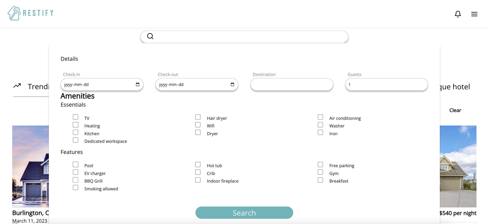
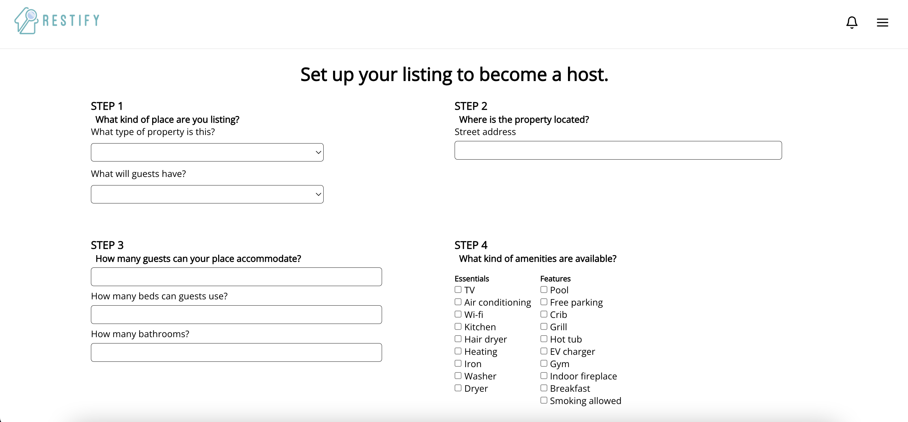
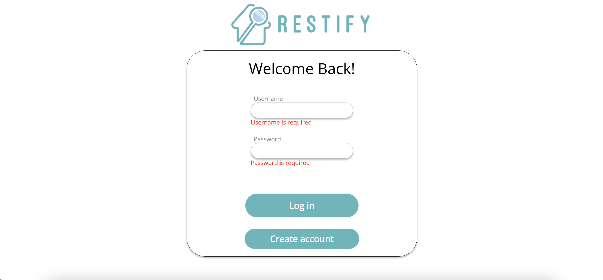

To run the app, please first use source startup.sh. Then source run.sh to run it, and source stop.sh to stop it.

# Restify Vacation Rentals

<!-- TABLE OF CONTENTS -->

  
Table of Contents

  <ol>
    <li>
      <a href="#about-the-project">About The Project</a>
      <ul>
        <li><a href="#built-with">Built With</a></li>
      </ul>
    </li>
    <li><a href="#features">Features</a></li>
    <li><a href="#contributers">Contributers</a></li>
  </ol>

<!-- ABOUT THE PROJECT -->
## About The Project
A web application for booking and hosting short term rental properties. The application supports users to be both hosts and guests, where as hosts, users can advertise different types of rental properties, accept and deny reauests, manage reservations at their properties and review users. As guests, users can browse properties available for their dates and specifications, request bookings, manage their reservations and review properties and hosts.   
 
To run the app, run `source startup.sh`, `source run.sh` and `source stop.sh`. Alternatively, run the application in Docker using `docker compose up -d` and `docker compose down`. Access the frontend development server [here](http://localhost:3000/) and the backend [here](http://localhost:8000/).  

### Built With

* [Django](https://www.djangoproject.com/)
* [Django Rest Framework](https://www.django-rest-framework.org/)
* [pillow](https://pillow.readthedocs.io/)
* [React](https://react.dev/)
* [Axios](https://www.npmjs.com/package/axios)
* [Docker](https://www.docker.com/)

<!-- Features -->
## Features

- [ ] user registration and sign in
- [ ] create and edit property listings
- [ ] detailed view of properties
- [ ] search based on date, location and features
- [ ] sort properties by price and name
- [ ] manage property listings, availablities and reservations
- [ ] preview users and properties
- [ ] orchestration of development server in Docker

(<a href="#top">back to top</a>)

<!-- CONTRIBUTERS -->
## Contributers
- Raazia Hashim
- Maryum Raina
- Zachery Lee

 [CSC309 - Programming on the Web](https://artsci.calendar.utoronto.ca/course/csc309h1)

(<a href="#top">back to top</a>)

